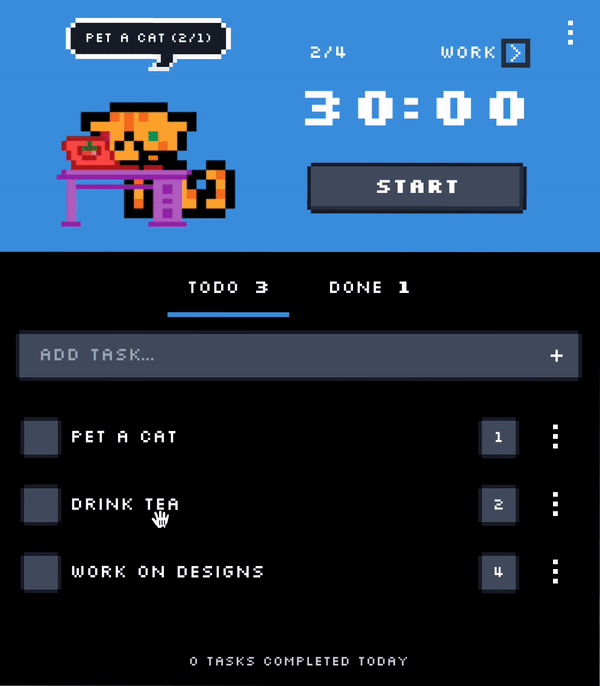

# TimeNeko 

Public repository of a TimeNeko app.

> Note: The app is currently in development.

## Overview:

- 8-bit like ui.
- Tasks list with drag and drop support and pomodoro tracking.  
  
- Flexible sessions - you can edit time whenever you want.

  

- Customizable session durations.
- Break notifications.
  
- Full-screen break overlay.
- Dark mode support.
- Integration with Trello
- Play 8-bit sound on break/work start.
- Break suggestions

The app is still in early stage, and I have plans for more features in the future ;).

### Plans for future features:

- Integration with various providers, like Jira etc. with time tracking.
- Time reports
- Statistics

  
More screenshots

### License

This project is under [GNU GPLv3](https://www.gnu.org/licenses/gpl-3.0.html)
